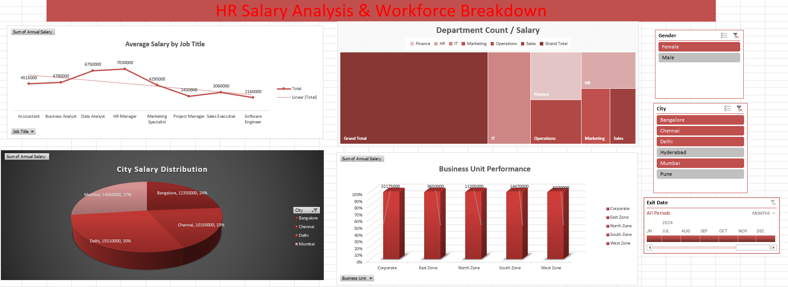

# 🧑‍💼 HR Salary Analysis Dashboard (Excel Project)

An interactive and data-driven HR Salary Analysis Dashboard built using Microsoft Excel, providing insights into workforce distribution, salary trends, department-wise performance, business unit contribution, and city-level salary segmentation.

This project showcases the capability of Excel for building dynamic dashboards using Pivot Tables, Slicers, Conditional Formatting, and Visualizations to support HR decision-making.

---

## 📊 Project Overview

The HR Salary Analysis Dashboard is designed to help HR teams analyze:

- Salary distribution  
- Workforce demographics  
- Department performance  
- Business unit contribution  
- City-wise salary breakdown  
- Employee exit trends  

The dashboard converts raw HR data into clear, actionable insights using Excel’s analytical and visualization tools.

---

## ❓ Problem Statement / Key Questions

- 🧑‍💼 What is the salary distribution across different job titles and departments?  
- 🏢 Which business units contribute the most to total salary payout?  
- 🌆 How are salaries distributed across cities?  
- 📅 What are the monthly exit trends?  
- 👨‍👩‍👧 What is the gender breakdown of employees?  
- 📈 What is the average salary by job title and how does it compare linearly?

---

## 📈 Key Metrics (KPIs)

| Metric | Insight |
|--------|---------|
| **Total Cities Covered** | 6 (Bangalore, Chennai, Delhi, Hyderabad, Pune, Mumbai) |
| **Highest Salary Distribution City** | Delhi (30%) |
| **Top Business Unit by Salary** | South Zone |
| **Gender Distribution** | Balanced Male–Female segmentation |
| **Exit Trend** | Monthly breakdown shown via timeline slicer |

> KPIs refresh automatically based on slicer filters.

---

## 🧾 Dataset Used

**Name:** Employee_Data_Full.xlsx  
**Format:** Excel  
**Rows:** 30+ employee records  

**Key Columns:**  
EEID, Name, Job Title, Department, Business Unit, Gender, Ethnicity, Age, Hire Date, Salary, Bonus %, Country, City, Exit Date  

> 📌 This dataset is used purely for academic and project purposes.

---

## 🛠 Tools & Techniques Used

- Microsoft Excel  
- Pivot Tables  
- Pivot Charts  
- Slicers & Timeline Filters  
- Conditional Formatting  
- Chart Customization (3D, Pie, TreeMap, Line, Bar)

---

## 🖼️ Dashboard Preview

### 🔹 HR Salary Analysis & Workforce Breakdown  

---

## 🎯 Key Insights

- ✅ Delhi contributes the highest share (30%) of total salary distribution.  
- ✅ South Zone and East Zone are the top-performing business units.  
- ✅ Business Analyst, Data Analyst, and HR Manager roles show strong average salary levels.  
- ✅ Gender distribution is well-balanced across departments.  
- ✅ Exit trends can be tracked across months using the timeline slicer.

---

## 👨‍💻 Developed By  
**Mamta Choudhary**  
*“Turning HR data into meaningful business insights.”*

---

## 📁 Project Files

| File | Description |
|------|-------------|
| **Dashboard.png** | High-quality HR Dashboard screenshot |
| **employee_data_full.xlsx** | HR dataset used to build the dashboard |
| **README.md** | Project documentation |
